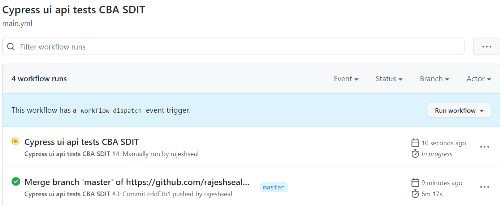
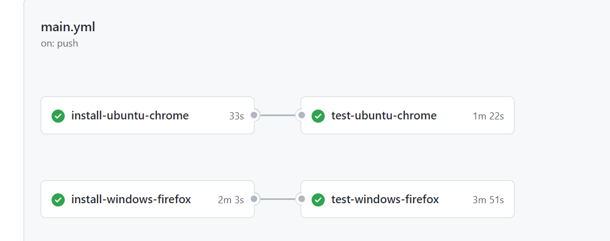

# Cypress - UI - API - CBA - SDIT Assignment

## About:   
The project is to validate UI page across different viewports and api tests.
The following use cases are tested
1. UI-User browse across menu on homepage
2. UI-Running the test across different viewports
3. UI-Running the test cross browser
4. API- Tests for 200, 404 and 400, Stub if requried

Tech Stack: `cypress` `JavaScript` `node` | AUT: https://www.commbank.com.au/ and  https://od-api.oxforddictionaries.com/api/v2/

---
## Features:  
The framework has following attributes
### Data Driven
The framework reads the `json` data files and uses for the test data and is agnostic to the records in data files.
### CI
The test framework is configured to work with GitHub Actions CI upon `push` and `manual` trigger.
The current configured jobs test the following combinations-
1. Ubuntu + Chrome
2. Windows + Firefox
Please refer the reference images in section `Running the tests in CI`
### Report
'mocha awesome reporter' is employed to compile the reports per spec and tests underneath the spec when tests are run through cli.
The report is created in `html` format and is stored under `/reports/mochareports/report.html`
#### 
### CLI 
The tests can be triggered via cypress ui and cli.
Please refer the `reference` section and `Running the tests in local machine`

---
## How to setup on local machine:
Clone repo on your system. Please make sure you have `Node` installed on your system.

1. Run `npm install` to install dependencies on system.
 
---
## Running the tests in local machine:
1. Execute `npm run test` command in terminal to run the tests in headless mode(default is chrome).
2. Execute `npm run test-headed` command in terminal to run the tests in headed mode.
3. Execute `npm run cypress-ui-open` command in terminal to open the Cypress GUI.

---
## Running the tests in CI:
The tests in CI can be run in 2 ways-
1. Auto run on `push` event.
2. Manual Run.
#### 
#### 

---
## Asssumtions:
1. AUT is `up and running` with `no change` to workflow.

---
## Enhancements:
1. Addition of required business assertions.
2. `Parameterize` the API tests
3. `Containerize` the framework.

---
## Open Issues:
1. `API Test Stubbing : Get request to mimic 400 is not getting intercepted` Issue raised in project.
2. API tests for `Project to translate `Test` into French` are to be written upon resolution of authentication issue.

---
## References
1. Cypress Command Line : https://docs.cypress.io/guides/guides/command-line#Commands

---